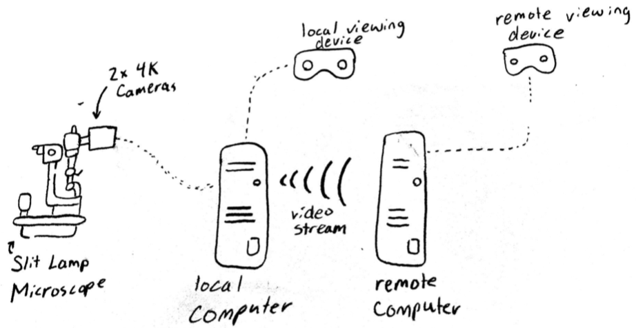

# Real-time Tele-Medicine in Ophthalmology

  

Slit Lamp Microscopes are an ophthalmology instrument used to allow doctors to inspect a patient's eyes in detail. The device really consists of two seperate parts. The first is the Slit Lamp which casts a narrow beam of light into the patient's eye to illuminate the ocular structures. The second is a stereoscopic microscope that actually enables the doctor to have a closer view while retaining a sense of depth. The problem with this device is that in order for another person to see what the primary doctor is seeing then they have to view it themselves through the lenses.

It is our team's goal to attach two 4K cameras to the lenses. The video output of these cameras should be sent to a viewing device such as a VR headset for the primary doctor to see. The two feeds should be spit on the left and right side of the screen to retain the depth perception. More importantly, the videos should also be streamed across the internet so that a remote client can view them. This will allow for a secondary doctor to give their opinion or for students to be able to view the operation themselves. 

This device would prove to be very useful as it would remove the need for secondary viewers to be physically present. However, this project does not come without constraints. For one, the primary, hardwired viewing device needs to have almost no latency at all so that the doctor can operate in real time. Any lag on this would severely inhibit the doctors abilities. In addition to that, the streamed video needs to have as little latency as possible so that the remote viewer can have efficient conversation with the primary doctor. The data itself that's streamed must also be encrypted and secure in order to comply with the Health Insurance Portability and Accountability Act (HIPAA). 
